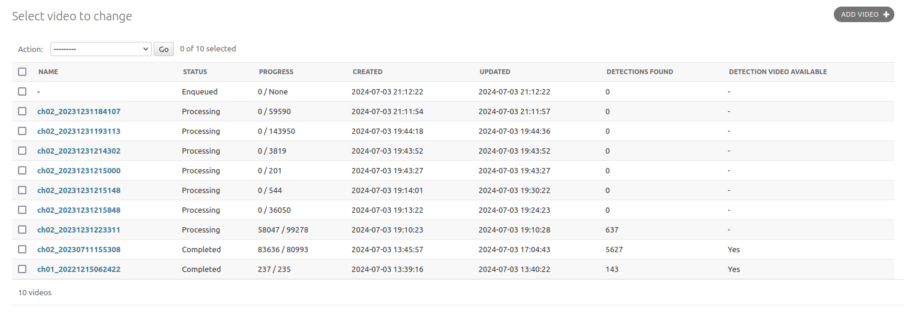
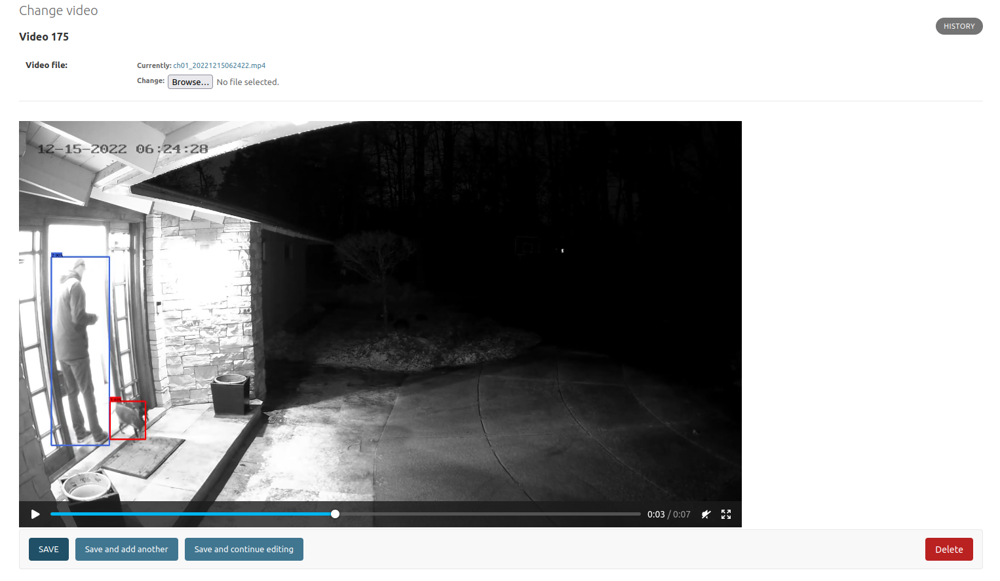

# AI-Powered Video Processing System

[](https://www.python.org/downloads/)
[](https://opensource.org/licenses/MIT)

## Find animals in your security camera footage using MegaDetector

I live in an area of the United States where I have a lot of random wildlife
wandering through my backyard. At the end of 2022, I put up security cameras so
I could spy on those little cuties. I very quickly realized, however, that
there's a whole lot of nothing that happens in between the times when the
fluffy little guys come sauntering through. I started thinking about it and, lo
and behold, someone out there on the internet has solved this problem for me.
The [MegaDetector](https://github.com/agentmorris/MegaDetector) project has a
pretty nifty AI model for finding animals in images. They've also provided some
Python code to demonstrate how to use it. And that, in a nutshell, is what this
repo is: me leveraging what I know about running distributed computer programs
with a nifty AI model that I can use to find animals in my backyard video
cameras.

## 🚀 Quick Demo

**Want to try it out? Just need Docker!**

```bash
# 1. Clone the repository  
git clone https://github.com/evz/video-processor.git
cd video-processor

# 2. Run with your own video
make demo DEMO_VIDEO=path/to/your/video.mp4

# 3. Watch your processed video!
# The command will show you exactly how to open the result
```

**Alternative: Use sample videos directory**
```bash
mkdir sample-videos
# Add your MP4 files to sample-videos/
make demo  # Automatically uses the first MP4 found in sample-videos/
```

**System Requirements:**
- **Docker** (only requirement!)
- **Optional**: Nvidia GPU + Container Toolkit for faster processing
- **Auto-detects**: Uses GPU acceleration if available, falls back to CPU

The demo runs the complete pipeline synchronously in a single container - no complex setup needed!

## 🛠️ Available Commands

```bash
# Demo and development
make demo                    # Run demo with first video in sample-videos/
make demo DEMO_VIDEO=path/to/video.mp4  # Use specific video
make demo FORCE_CPU=true     # Force CPU-only mode

# System info
make check-system           # Show detected GPU/Docker capabilities

# Building
make build                  # Build appropriate image (GPU or CPU)
make build-gpu             # Build GPU-optimized image
make build-cpu             # Build CPU-only image

# Running services
make start-web             # Start Django admin interface
make start-workers         # Start processing workers
make start-full           # Start complete distributed system

# Utilities
make clean                 # Stop containers and cleanup
make migrate              # Run database migrations
make help                 # Show all available commands
```

## ⚙️ Environment Variables

The demo automatically creates a `.env` file with sensible defaults, but you can customize these variables:

| Variable | Default | Description |
|----------|---------|-------------|
| `DOCKER_IMAGE` | `video-processor:latest` | Docker image name for GPU processing |
| `USE_CPU_ONLY` | `true` (local), `false` (AWS) | Use CPU-only processing (no GPU required) |
| `USE_SYNCHRONOUS_PROCESSING` | `true` (local), `false` (AWS) | Run all tasks synchronously in demo mode |
| `CLEANUP_AFTER_PROCESSING` | `no` (local), `yes` (AWS) | Delete intermediate files after processing |
| `DJANGO_SECRET_KEY` | `foobar-please-change-me` | Django secret key |
| `DJANGO_SUPERUSER_USERNAME` | `foo` | Django admin username |
| `DJANGO_SUPERUSER_PASSWORD` | `foobar` | Django admin password |
| `DJANGO_SUPERUSER_EMAIL` | `test@test.com` | Django admin email |
| `DB_HOST` | `db` | Database hostname |
| `DB_NAME` | `processor` | Database name |
| `DB_USER` | `processor` | Database username |
| `DB_PASSWORD` | `processor-password` | Database password |
| `DB_PORT` | `5432` | Database port |
| `REDIS_HOST` | `redis` | Redis hostname for Celery broker |
| `STORAGE_MOUNT` | `.` (local), `/storage` (AWS) | Host directory to mount for file storage |
| `EXTRACT_WORKERS_PER_HOST` | `1` | Number of frame extraction workers |
| `DETECT_WORKERS_PER_HOST` | `1` | Number of AI detection workers |

**AWS-specific variables** (for distributed setup):
| Variable | Description |
|----------|-------------|
| `AWS_ACCESS_KEY_ID` | AWS access key for S3/SQS |
| `AWS_SECRET_ACCESS_KEY` | AWS secret key |
| `AWS_REGION` | AWS region (e.g., `us-east-2`) |
| `FRAMES_BUCKET` | S3 bucket for storing frame images |
| `VIDEOS_BUCKET` | S3 bucket for storing video files |

## 🔧 Management Commands

Django management commands for common operations. Run these inside the admin container or with `docker exec`:

```bash
docker exec video-processor-admin-1 python3 manage.py <command> [options]
```

### `process_video` - Synchronous Processing

Process a single video through the complete pipeline synchronously (useful for testing/demos):

```bash
python3 manage.py process_video /path/to/video.mp4
python3 manage.py process_video /path/to/video.mp4 --name "custom-name"
```

### `bulk_add_videos` - Batch Import

Add multiple videos from a directory for processing:

```bash
# Add all videos from a directory
python3 manage.py bulk_add_videos /path/to/videos/

# Custom file pattern
python3 manage.py bulk_add_videos /path/to/videos/ --pattern "*.mp4"

# Recursive search
python3 manage.py bulk_add_videos /path/to/videos/ --recursive

# Preview what would be added
python3 manage.py bulk_add_videos /path/to/videos/ --dry-run
```

### `reprocess_videos` - Recovery & Reprocessing

Recover from stuck or failed video processing (e.g., after worker restarts):

```bash
# Fix videos that have all frames completed but are stuck in PROCESSING status
python3 manage.py reprocess_videos --fix-completed

# Requeue videos that never got chunked (stuck at first stage)
python3 manage.py reprocess_videos --stuck-chunks

# Reprocess specific video IDs
python3 manage.py reprocess_videos --ids 6000 6001 6002

# Reprocess a range of video IDs
python3 manage.py reprocess_videos --range 6000 6064

# Preview what would happen
python3 manage.py reprocess_videos --stuck-chunks --dry-run
```

**When to use `reprocess_videos`:**
- After restarting workers while tasks were in-flight
- When videos are stuck in PROCESSING status
- To retry failed video processing

## 🎯 What This Project Demonstrates

- **Distributed Systems**: Celery-based processing pipeline with multiple worker types
- **AI/ML Integration**: MegaDetector v5a for object detection  
- **GPU Computing**: CUDA acceleration for video processing
- **Cloud Architecture**: AWS deployment with S3 storage and SQS messaging
- **Containerization**: Docker setup for local and distributed deployment
- **Video Processing**: FFmpeg integration for chunking and frame extraction

## 🏗️ Processing Pipeline

```
┌─────────────────┐    ┌─────────────────┐    ┌─────────────────┐
│   Video Upload  │───▶│  Chunk Video    │───▶│ Extract Frames  │
│   (Django Web)  │    │  (30s segments) │    │   (FFmpeg)      │
└─────────────────┘    └─────────────────┘    └─────────────────┘
                                                        │
┌─────────────────┐    ┌─────────────────┐    ┌─────────────────┐
│ Generate Output │◀───│  AI Detection   │◀───│   Queue Frames  │
│   (Final Video) │    │ (MegaDetector)  │    │   (Parallel)    │
└─────────────────┘    └─────────────────┘    └─────────────────┘
```

As of the summer of 2024, I'm still trying to figure out how to speed it up
without spending thousands on GPU instances on AWS (or a suped up desktop or
something) and, honestly, I think I've reached the limits of what my laptop
equipped with an Nvidia RTX 2070 can do. To process around 90 minutes of video
is currently taking me about 3.25 hours on my laptop. **However** ... I
recently got the chance to test this on an Alienware Area 51 with the new RTX
5090 and saw about 10x performance improvement! So there's definitely room for
speed gains with better hardware. I also put together a Dockerfile and
docker-compose.yaml that one _could_ use to run this across several GPU
equipped EC2 instances or something.  Note that this probably requires a trust
fund or some other means by which you can finance this without impacting your
ability to pay rent. I processed exactly _one_ approximately 90 minute long
video on a `g5.xlarge` instance and my laptop and it took ... about 90 minutes.
Which I guess means I could have just sat there and watched it myself. :shrug:
You can use that information however you want to. I'll get into the nitty
gritty of how to set this project up to run that way further down in the README
but first let's talk about what it takes to run it in the first place.

### Prerequisites

For optimal performance, you'll want a Nvidia GPU equipped computer, though the system can run on CPU-only for demos and testing.
I've never attempted to run it on anything other than Ubuntu 22.04 with version
12.5 of the Nvidia CUDA Toolkit but I think it'll probably work with older
versions as well. Getting that setup can be a little weird but most concise
instructions I've found are
[here](https://developer.nvidia.com/cuda-downloads). I make no claims to know
very much about that process but if you get stuck, maybe we can put our heads
together and figure it out (just open an issue).

One other thing that has been a bit of a struggle for me with this is having
enough space on a fast enough disk. Firstly, extracting all of the frames from
hours of video takes up a whole bunch of disk space. I tried to make it so the
JPEG compression that the project uses is good enough to retain quality but
also make the files a little smaller. That said, a video of approximately 90
minutes has over 100,000 images in it (and that's at a pretty low frame rate).
In my experience, this can consume around 180GB of disk space. 

The other thing that ends up requiring a lot of disk space are the docker
images. The image that the Dockerfile in this repo builds is over 10GB so when
you're messing around with it and building different versions, it can add up.

Besides space, the disk needs to be relatively fast. So, if you're thinking
"I've got a big 'ol USB backup drive I can use for this", just be prepared to
wait because having fast disk ends up making a real difference. Further down
when I talk about how to distribute this across several systems, the setup
seamlessly uses AWS S3 for a storage backend. This is _fine_ I guess (and
really the only way to make it work in a distributed way) but, again, using a
local, fast disk really makes it better.

To use the Docker setup, you'll also need to install the [Nvidia Container
Toolkit](https://docs.nvidia.com/datacenter/cloud-native/container-toolkit/latest/install-guide.html).
FWIW, that's probably going to be the vastly simpler way of using this (and, to
be honest, probably the better way, since it'll be easier to scale and run
across several systems, too). You also won't need to worry about getting the
CUDA Toolkit setup on your host since the container handles all of that for you
and just leverages whatever GPU you have on your host. 

So, to summarize for the people who are just skimming, the prerequisites are:

* **For trying it out**: Just Docker (auto-detects GPU vs CPU)
* **For reasonable performance**: Nvidia GPU
* Debian-ish Linux distro (tested on Ubuntu 22.04)
* [Nvidia CUDA Toolkit](https://developer.nvidia.com/cuda-downloads) (tested with 12.5 but older versions will probably work)
* A lot of disk space on a fast disk (optional but, like, definitely worth it)
* For Docker: [Nvidia Container Toolkit](https://docs.nvidia.com/datacenter/cloud-native/container-toolkit/latest/install-guide.html)

### How do I make it go?

The simplest way to run this is with the demo command (see Quick Demo section
above), which handles everything automatically. For the full distributed system
with Celery workers, you'll need a GPU setup:

* Build the GPU docker image (see "Docker build process" below)
* Make a copy of the example local env file and make changes as needed
  (probably the only thing you'll want to think about changing is the
  `STORAGE_MOUNT` but, it should just work as is)
```
cp .env.local.example .env.local
```
* Run the docker compose file using the copy of the env file you just made:

```
docker compose -f docker-compose-local.yaml --env-file .env.local up
```

That's basically it. You should get an `admin` container for free.  By default,
it's configured to make a user for you if you set `DJANGO_SUPERUSER_USERNAME`,
`DJANGO_SUPERUSER_PASSWORD` and `DJANGO_SUPERUSER_EMAIL` in your `.env.local`
file. Then you should be able to login using those creds by navigating to
`http://127.0.0.1:8000/admin` in your web browser. If you're familiar with the
Django Admin, this should look familiar.  Once you're logged in, you can click
through to `Video` and then `Add Video` in the upper right hand corner. From
there, you should be prompted for a file to upload. Once the video is uploaded,
it should start processing. 

### Running in a more distributed way 

The example I've included for running this in a distributed way is running some
workers on an AWS EC2 instance with a GPU and some workers on a local machine.
If you'd like to run this _entirely_ on AWS or another cloud provider, one
thing you'll need to do is make the `admin` container slightly less dumb. Right
now it's just using the Django development server and isn't behind a web
server, isn't using SSL, etc, etc. I'd really, really recommend _not_ just
running that as is anywhere but your local machine. I've been deploying Django
in production environments since 2009 and have done this in Docker a few times
as well so if you get stuck attempting to Google for it, open an issue and I'll
give you some pointers.

At any rate, the tl;dr to get this running on AWS is:

* **Ask AWS to let you spin up GPU instances** If you don't already have
  permission, this is something that you have to submit a support ticket to get
  turned on. They seem to get back to you pretty quickly but, it's a step
  nonetheless. If you're not familiar with how they do these things, you're
  asking for the ability to run a certain number of vCPUs of a given instance
  type. I was able to get 8 vCPUs "granted" to me for "G" type instances (which
  are the cheapest GPU instances as of early 2024).
* **Spin up your GPU instance and install things** I've included instructions
  for getting things setup on an Ubuntu 22.04 machine above (see
  "Prerequisites") and it should work in more or less the same way if
  you're using Ubuntu 22.04 for your new instance. One nice thing that is
  included with the "G" type instances is a 250GB instance store which I
  started using for my docker setup so that I didn't have to pay for a
  massive EBS volume. If you want to do something similar, you can format
  and mount that device and then add a `/etc/docker/daemon.json` file that
  tells your docker setup where to cache the images. I'll let you go ahead
  and Google that so this tl;dr doesn't get too long.
* **Build the docker image** You can either do this locally and push the image
  to AWS's Container Registry (aka ECR; that's what I was doing) or just build
  the image on your new instance. Either way, you can follow the Docker build
  process below. Before you push to ECR, you'll need to get the login creds and
  configure docker to use them. Here's a nifty one-liner for that:
  ```
  aws ecr get-login-password --region us-east-2 | docker login --username AWS --password-stdin <your-ecr-hostname>
  ```
* **Make a DB instance** You should be able to use the smallest instance type
  available to run PostgreSQL or, if you're fancy (and really like giving AWS
  money) you can use RDS or Aurora. You should be able to just spin up a Linux
  instance of your choosing and install PostgreSQL on it. You'll want to edit
  your `pg_hba.conf` file to allow your GPU instance(s) and your local machine
  to connect to it. Also make sure it uses the same security group as the GPU
  instance(s) you spun up. That'll make the next step easier.
* **Setup your Security Group** You'll want to add a couple rules. One that
  allows instances that are associated with that security group to connect to
  one another on port 5432, and then one that allows your local machine to
  connect to it on port 5432. I suppose you could make a couple security groups
  and make that a little cleaner but, ya know, let's just get to the good part,
  shall we?
* **Copy the example .env file** Similar to running this thing locally, you'll
  need to make a copy of `.env.aws` and make changes to it as needed. At the
  very least you'll need to change:
    - `AWS_ACCESS_KEY_ID`
    - `AWS_SECRET_ACCESS_KEY`
    - `AWS_REGION`
    - `FRAMES_BUCKET`
    - `VIDEOS_BUCKET`
    - Probably most of the `DB_*` vars based on how you setup your DB instance
    - `EXTRACT_WORKERS_PER_HOST` Configures the number of replicas to make that
      will be extracting images from the video chunks. On a `g5.xlarge` I was
      able to get away with 4. On my laptop with an RTX 2070, I used 2. 
    - `DETECT_WORKERS_PER_HOST` Configures the number of replicas to make that
      will work on finding things in the frames of the videos. On a `g5.xlarge`
      I was able to use 4. On my laptop with an RTX 2070, I used 2.
    - `STORAGE_MOUNT` You'll probably want to use the instance store for this.
      There's a part in the processing where chunks of the video files get
      written to disk so you'll need some space. They get cleaned up as they
      are being processed but, still something worth noting. 
* **Run it!** You should be able to run the AWS version of the docker compose
  file along with the AWS version of the .env file on the GPU instance(s) as
  well as your local machine like so:
```
# Run the admin, detect and extract containers locally
docker compose -f docker-compose-aws.yaml --env-file .env.aws up admin detect extract

# ... and on your GPU instance ...
# Run the detect, extract and chunk_video containers
docker compose -f docker-compose-aws.yaml --env-file .env.aws up chunk_video detect extract
```
* **Process a file** This is the same as on a local setup. Just navigate to
  `http://127.0.0.1:8000/admin` on your local machine, login and then click
  through the UI to upload a new Video. 

That probably glosses over some details but if you're comfortable with AWS and
OK at Googling, you should be able to get things going. If not, open an issue
and I'll see if I can help you out.

### OK, I've processed a video, now what?

The main output of this is a DB table that records where in an image the
detector found something and what kind of a thing it is. What does it look
like? Here's what the DB table looks like: 

```
  id  | category | confidence |  x_coord  | y_coord | box_width | box_height | frame_id 
------+----------+------------+-----------+---------+-----------+------------+----------
  319 | 2        |      0.699 |   0.08125 |  0.3629 |      0.05 |     0.3407 |     1331
  366 | 2        |      0.793 |   0.07812 |  0.3638 |   0.05312 |     0.3407 |     1332
  314 | 2        |      0.793 |   0.07812 |  0.3638 |   0.05312 |     0.3407 |     1333
  348 | 2        |      0.736 |   0.07604 |  0.3638 |   0.05572 |     0.3388 |     1334

... etc ...
```
The `category` is what kind of thing (1 = animal, 2 = person, 3 = vehicle) is
represented by the detection. The `confidence` is how confident the model was
that it is, in fact, the thing that it thinks it is. The coordinates represent
the upper left hand corner of where the detection was in the image and you can
use the `box_width` and `box_height` to figure out how big the box is. 

There's a process that checks every so often to see if there are any videos
that are done processing and, if so, it kicks off the process of taking all the
images where something was detected and stitches them back together into a
video. When that's done, you'll be able to check it out by clicking on the name
of the video in the Django admin. 

**List of videos uploaded for processing**


**Detail of completed video**


### Docker build process

**IMPORTANT: GPU Build Requirement**

Before building the GPU image, you need the NVIDIA Video Codec SDK:

1. Visit https://developer.nvidia.com/video-codec-sdk/download
2. Download the **Video Codec SDK** (requires free NVIDIA Developer account)
   - **Tested versions**: 13.0.37
   - Newer versions will likely work but haven't been tested
3. Place the `Video_Codec_SDK_*.zip` file in the root of this project directory
   - The build process will automatically detect and use whichever version you download

This SDK provides the libraries needed for GPU-accelerated video decoding with decord.

**Building the images:**

The system automatically builds the appropriate Docker image (CPU or GPU) based on your hardware. For manual building:

**CPU-only image** (works anywhere, no SDK needed):
```
make build-cpu
```

**GPU-accelerated image** (requires Nvidia Container Toolkit + Video Codec SDK):
```
make build-gpu
```

Or let the system auto-detect:
```
make build
```

The build will probably take around 5-10 minutes and use around 6GB (CPU) or 10GB+ (GPU) of disk.

### How this project is stitched together

The short version is that this project uses Django + Celery to run a couple
different "chunks" of the processing pipeline in a more or less distributed
way. Could it be more distributed? Probably. But I'm not really willing to give
AWS that kind of money (yet). You'll see these stages reflected in the [celery
tasks](processor/tasks.py) and in the names of the services in the
`docker-compose` files. These stages look like this:

**Break the video into chunks** To handle large video files efficiently and
enable parallel processing, `ffmpeg` breaks long videos into 30-second chunks.
This approach prevents memory issues with very large files and allows the
system to start processing frames from early chunks while later chunks are
still being created. FFmpeg can use GPU acceleration to speed up this chunking
process when available. 

**Extract frames from the video chunks** As I'm sure you've guessed, this
iterates through the chunks of the video and saves out each frame as a separate
image and makes a row for each frame in the DB. This is really where the
storage backend you're using will come into play since, as I mentioned above,
an approximately 90 minute video with a framerate of 20 fps will use up about
180GB of disk. If you're using S3, you'll need to consider the data transfer
costs ($$$ as well as time), too (unless you're doing _all_ your processing in
AWS).  

**Detect whether or not there are interesting things in the images** This is
the meat and potatoes of the process. It uses the MegaDetector v5a model to
figure out if there are likely to be animals, people, or vehicles in each frame
of the video and, if it finds things, it saves its findings to a DB table. 

**Check if videos are done processing and stitch the interesting images back
into a video** There's a periodic task that runs every 10 seconds to see if
there are any videos that are done processing. If so, it kicks off another task
which takes all the images where something was detected and stitches them back
together into a video. If you take a look at the table showing the list of
videos you've uploaded for processing, you should be able to see whether
there's a video available or not. You can check it out by clicking on the name
of the video and looking at its detail page.

### Things I've run into which are slightly puzzling to me

The one step in this process that has always vexed me is the part where the
video gets broken apart into individual images for each frame. If you look back
in the git history for this repo, you'll notice that I was using OpenCV to
extract the frames at first. The problem I had with that was that, for my
videos in particular, OpenCV would end up not extracting all of the frames in
an individual file. This seems to have something to do with the fact that the
video codec that is used to encode the files on my little security camera
system doesn't have very good metadata so any open source tool just gets
garbage in. 

I did find that `ffmpeg` could extract all the frames if you gave it the
correct incantations but it was always limited since you can only run it in one
process. Even the hardware acceleration that you can get with the Nvidia
Toolkit doesn't really help much (it seems to be more for encoding videos). I
tried breaking the work of extracting frames up into smaller chunks and then
just telling a bunch of workers to have `ffmpeg` only extract a particular
chunk but the problem then became the fact that, as the processing got farther
and farther into the video, `ffmpeg` would have to scan the video farther and
farther which was just a non-starter for very large videos. 

The current approach uses `ffmpeg` throughout the pipeline, which is more
reliable with different video codecs and metadata issues. By breaking videos
into 30-second chunks and using `ffmpeg` for both chunking and frame
extraction, the system handles problematic video files much better than
previous attempts with OpenCV or other libraries. This approach isn't perfect
but it's much more robust for the variety of security camera footage I
encounter. All I want is to stare at cute little animals in my backyard!

## 📈 Performance & Scale

**AI Detection Performance:**
- **Intel Core i7-12700 (CPU)**: ~0.5 images/second (MegaDetector docs)
- **RTX 2070 (GPU)**: ~3.25 hours for 90 minutes of video
- **RTX 5090 (GPU)**: ~10x performance improvement over RTX 2070

**System Scaling:**
- **Cloud Scaling**: Tested on AWS g5.xlarge instances 
- **Storage Requirements**: ~180GB for 90 minutes of video at 20fps
- **Architecture**: Fully containerized with Docker, scalable across multiple GPU instances

## 🛠️ Technologies

**Core Stack**: Django, Celery, PostgreSQL, Redis/SQS  
**AI/ML**: MegaDetector v5a, PIL  
**Video Processing**: FFmpeg (CPU and GPU-accelerated)  
**Infrastructure**: Docker, CUDA (optional)  
**Cloud**: AWS (EC2, S3, SQS)

### A coyote walking through my backyard in the middle of the night


